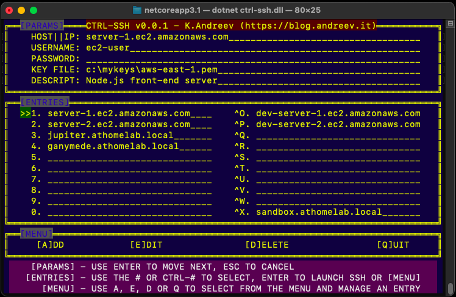

# ctrl-ssh
**ctrl-ssh** is a small console GUI ssh connection manager written in .NET Core 3.1. It works for both Windows and Mac OS X. I didn't test under Linux, but with some modifications it might work. If you use OS X, make sure that your terminal size is set to 80x25. For Windows, the program takes care of that, but under OS X, the terminal size can't be controled from .NET Core.

I use this program primarilly on OS X, the alternatives are either expensive or difficult to maintain. For Windows, I stick to putty.

NOTE: If you run this on Windows and you use a PEM key, you might get this error when you try to log in.

@@@@@@@@@@@@@@@@@@@@@@@@@@@@@@@@@@@@@@@@@@@@@@@@@@@@@@@@@@@
@         WARNING: UNPROTECTED PRIVATE KEY FILE!          @
@@@@@@@@@@@@@@@@@@@@@@@@@@@@@@@@@@@@@@@@@@@@@@@@@@@@@@@@@@@

RESOLUTION: Execute the following commands.
```
set key="c:\file-location"
cmd /c icacls %key% /c /t /inheritance:d
cmd /c icacls %key% /c /t /grant %username%:F
cmd /c icacls %key%  /c /t /remove Administrator BUILTIN\Administrators BUILTIN Everyone System Users "Authenticated Users"
cmd /c icacls %key%
```
## Sections and navigation



The program contains four sections.

<ul>

**PARAMS**

**ENTRIES**

**MENU**

**QUICK HELP**
</ul>

### **PARAMS**
This section has the parameters required for each SSH connection. These parameters are hostname or IP address, the username, password, the key file and a description. They are self explanatory. The key file has to be in PEM format. 

You navigate through the parameters with **ENTER** to advance to the next parameter or **ESC** to cancel. There is no way to go up. Also, if you hit **ESC** after the first line, only the changes after that line will be discarded. All previous changes are already saved. 
If you hit **ENTER** and made a mistake, hit **ENTER** several times to pass the *DESCR* parameter and then **EDIT** the connection.  A small **QUICK HELP** at the bottom of the program screen briefly describes the keyboard shortcuts. 

### **ENTRIES**
The entries are the actual connections. You don't edit the entries. To navigate, just hit the number in front of the entry or CTRL + the number. If you have OS X, due to CTRL keys mapped differently, you have to use CTRL + a letter from O to X.
When you are not editing an entry, if you hit ENTER you will connect to that SSH server. 

*For example*, once you define your connections, if you hit 3 and ENTER, you will connect to the 3rd connection in the list.

For Windows, the program launches a **PowerShell** session and for OS X, the program launches the built-in **Terminal** app. If you have a non-default installations, make sure to update the paths to these programs in the source code and recompile. 

### **MENU**
The menu allows you to add, edit, delete an entry and to quit the application. Simply hit **A**, **E**, **D** or **Q** from the main screen. 

*For example*, if the entries cursor **>>** if positioned at 3 and you hit D, the entry will be deleted (no confirmation is asked). If you hit A, you'll be taken to the **PARAMS** section where you can add a new entry.

### **QUICK HELP**
This section describes briefly how to navigate the program. 

## How it works
When the program starts it looks for the config file **ctrl-ssh.cfg** under:
<ul>

*Windows*: C:\Users\\&lt;**username**&gt;\AppData\Local

*OS X*: Users/&lt;**username**&gt;/.local/share
</ul>

This file is encrypted. If you get an error at the beginning regarding cryptography, it means the file is corrupted and you can't fix it manually. Just delete the file and start from scratch (or restore from snaps).

When you exit the file using Q or if you close the console window, the changes are saved. The changes in the connections are saved only in memory during the execution of the program. If you want to save changes in the file, simply close the program and start it again.

For the Windows version, the program opens a PowerShell window in a separate window for each connection. The reason is because the Windows console can't spawn a console from itself. 

For OS X version, the program uses the *nix command **open** to open the built-in **Terminal** application in a separate window. 

**ctrl-ssh** doesn't interfere with any PowerShell/Terminal console settings. Whatever is you default, that's what's being used. 

## Compile and execute
I don't use any special configurations for the program. The program was tested with VS 2019 for Windows and OS X and .NET Core 3.1. Under OS X, test the program by running the DLL in the Debug/Release folder witrh **dotnet** prefix, e.g. *dotnet filename.dll*

## Compatibilty
Tested on both Windows 10 64-bit and OS X Big Sur. I am sure it will work on other platforms as long as you have .NET Core 3.1 or higher. 

## Download
Both standalone pre-compiled versions are available for Windows 64-bit and OS X in the releases.


